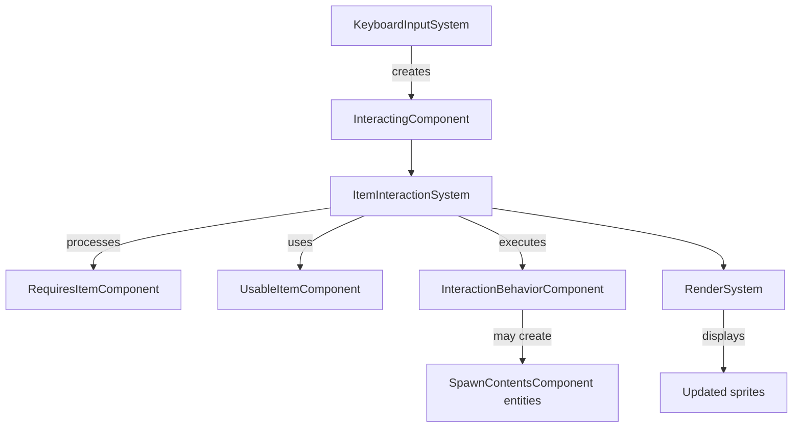

# ECS Architecture Documentation

## Overview

This document describes the Entity-Component-System (ECS) architecture implementation used in the Untitled Game project, including the new Entity Interaction System.

## Table of Contents

- [Core ECS Concepts](#core-ecs-concepts)
- [Component System](#component-system)
- [System Implementation](#system-implementation)
- [Entity Interaction System](#entity-interaction-system)
- [Integration Points](#integration-points)
- [Usage Examples](#usage-examples)

## Core ECS Concepts

### Entity

An entity is a unique identifier with a collection of components. Entities are plain data structures that hold references to their components.

```typescript
interface Entity {
  id: string;
  components: ComponentDictionary;
}
```

### Component

Components are pure data containers that define the properties of entities. They contain no logic, only state.

### System

Systems contain the logic that operates on entities with specific component combinations. They process entities during each update cycle.

## Component System

### Component Registration

All components are registered in the `ComponentTypes.ts` file:

```typescript
export enum ComponentType {
  Position = 'position',
  Sprite = 'sprite',
  Player = 'player',
  // ... other components
  RequiresItem = 'requiresItem',
  UsableItem = 'usableItem',
  InteractionBehavior = 'interactionBehavior',
  SpawnContents = 'spawnContents',
}
```

### Component Structure

Each component follows a consistent pattern:

```typescript
export class ExampleComponent implements Component {
  public readonly type = ComponentType.Example;
  
  constructor(props: ExampleComponentProps) {
    // Initialize component properties
  }
}
```

## System Implementation

### System Interface

All systems implement the `System` interface:

```typescript
interface System {
  update(args: UpdateArgs): void;
}

interface UpdateArgs {
  entities: Entity[];
  map: GameMap;
  time?: Ticker;
}
```

### System Execution Order

Systems are executed in a specific order to maintain data flow integrity:

1. **KeyboardInputSystem** - Handles user input, adds temporary components
2. **MovementSystem** - Processes movement logic
3. **PickupSystem** - Handles item collection
4. **ItemInteractionSystem** - Processes item-based interactions
5. **RenderSystem** - Updates display elements
6. **CleanUpSystem** - Removes temporary components

## Entity Interaction System

The Entity Interaction System enables contextual item usage through capability-based entity relationships.

### Core Components

#### RequiresItemComponent

Marks entities as targets requiring specific item capabilities for interaction.

```typescript
interface RequiresItemComponentProps {
  requiredCapabilities: string[];
  isActive: boolean;
}

// Example Usage
const doorComponent = new RequiresItemComponent({
  requiredCapabilities: ['unlock'],
  isActive: true
});
```

**Properties:**
- `requiredCapabilities`: Array of capability strings required for interaction
- `isActive`: Boolean indicating if the entity can currently be interacted with

#### UsableItemComponent

Marks items with specific capabilities that can be used in interactions.

```typescript
interface UsableItemComponentProps {
  capabilities: string[];
  isConsumable: boolean;
}

// Example Usage
const keyComponent = new UsableItemComponent({
  capabilities: ['unlock'],
  isConsumable: true
});
```

**Properties:**
- `capabilities`: Array of capability strings this item provides
- `isConsumable`: Boolean indicating if the item is consumed after use

#### InteractionBehaviorComponent

Defines how target entities respond to successful interactions.

```typescript
interface InteractionBehaviorComponentProps {
  behaviorType: InteractionBehaviorType;
  newSpriteId?: string;
  isRepeatable: boolean;
}

enum InteractionBehaviorType {
  TRANSFORM = 'transform',
  REMOVE = 'remove',
  SPAWN_CONTENTS = 'spawn_contents'
}

// Example Usage
const doorBehavior = new InteractionBehaviorComponent({
  behaviorType: InteractionBehaviorType.TRANSFORM,
  newSpriteId: 'door_open',
  isRepeatable: false
});
```

**Properties:**
- `behaviorType`: Enum defining the interaction response (TRANSFORM, REMOVE, SPAWN_CONTENTS)
- `newSpriteId`: Optional sprite ID for TRANSFORM behavior
- `isRepeatable`: Boolean indicating if interaction can be repeated

#### SpawnContentsComponent

Defines entities to spawn when SPAWN_CONTENTS behavior is triggered.

```typescript
interface SpawnContentsComponentProps {
  contents: EntityTemplate[];
  spawnOffset?: { x: number; y: number };
}

// Example Usage
const chestContents = new SpawnContentsComponent({
  contents: [
    {
      components: {
        sprite: { sprite: 'treasure_gold' },
        pickable: {},
      },
    },
  ],
  spawnOffset: { x: 1, y: 0 }
});
```

**Properties:**
- `contents`: Array of EntityTemplate objects to spawn
- `spawnOffset`: Optional position offset for spawned entities

### Interaction Workflow

The interaction system follows this workflow:

1. **Input Detection**: KeyboardInputSystem detects E-key press, adds `InteractingComponent`
2. **Entity Scanning**: ItemInteractionSystem finds entities with `InteractingComponent`
3. **Target Identification**: System locates entities with `RequiresItemComponent` at player position
4. **Capability Matching**: System matches player's carried items with target requirements
5. **Behavior Execution**: System executes the appropriate `InteractionBehaviorComponent` behavior
6. **Item Consumption**: System handles consumable items based on `UsableItemComponent.isConsumable`
7. **Cleanup**: CleanUpSystem removes temporary `InteractingComponent`

### Capability Matching Logic

The system uses array intersection logic for capability matching:

```typescript
// Player has key with capabilities: ['unlock', 'gold-door']
// Target requires capabilities: ['unlock']
// Result: Match found (key can unlock door)

// Player has hammer with capabilities: ['break', 'construction']
// Target requires capabilities: ['unlock']
// Result: No match (hammer cannot unlock)
```

### Interaction Behaviors

#### TRANSFORM Behavior

Changes the target entity's sprite and deactivates the RequiresItemComponent:

```typescript
// Before interaction: door_closed sprite, isActive: true
// After interaction: door_open sprite, isActive: false
```

#### REMOVE Behavior

Completely removes the target entity from the game world:

```typescript
// Before interaction: wall entity exists
// After interaction: wall entity removed from entities array
```

#### SPAWN_CONTENTS Behavior

Removes target entity and creates new entities from SpawnContentsComponent:

```typescript
// Before interaction: chest entity with contents defined
// After interaction: chest removed, treasure items spawned at location
```

## Integration Points

### With Existing Systems

#### KeyboardInputSystem Integration

The ItemInteractionSystem processes `InteractingComponent` entities created by KeyboardInputSystem when the player presses the E key.

#### PickupSystem Integration

Items collected by PickupSystem receive `CarriedItemComponent`, making them available for interaction system capability matching.

#### RenderSystem Integration

When InteractionBehaviorComponent executes TRANSFORM behavior, RenderSystem automatically displays updated sprites.

### Component Dependencies



## Usage Examples

### Basic Door and Key Interaction

```typescript
// Create a key entity
const keyEntity = createEntityFromTemplate({
  components: {
    sprite: { sprite: 'key_gold' },
    pickable: {},
    usableItem: {
      capabilities: ['unlock'],
      isConsumable: true
    }
  }
});

// Create a door entity
const doorEntity = createEntityFromTemplate({
  components: {
    sprite: { sprite: 'door_closed' },
    requiresItem: {
      requiredCapabilities: ['unlock'],
      isActive: true
    },
    interactionBehavior: {
      behaviorType: InteractionBehaviorType.TRANSFORM,
      newSpriteId: 'door_open',
      isRepeatable: false
    },
    position: { x: 5, y: 5 }
  }
});

// Workflow:
// 1. Player picks up key (PickupSystem adds CarriedItemComponent)
// 2. Player approaches door and presses E (KeyboardInputSystem adds InteractingComponent)
// 3. ItemInteractionSystem matches key's 'unlock' capability with door's requirement
// 4. Door transforms from 'door_closed' to 'door_open' sprite
// 5. Key is consumed (removed from player inventory)
```

### Reusable Tool Interaction

```typescript
// Create a hammer (reusable tool)
const hammerEntity = createEntityFromTemplate({
  components: {
    sprite: { sprite: 'hammer' },
    pickable: {},
    usableItem: {
      capabilities: ['break', 'construct'],
      isConsumable: false // Reusable tool
    }
  }
});

// Create a breakable wall
const wallEntity = createEntityFromTemplate({
  components: {
    sprite: { sprite: 'wall_cracked' },
    requiresItem: {
      requiredCapabilities: ['break'],
      isActive: true
    },
    interactionBehavior: {
      behaviorType: InteractionBehaviorType.REMOVE,
      isRepeatable: false
    },
    position: { x: 3, y: 3 }
  }
});

// Workflow:
// 1. Player uses hammer on wall
// 2. Wall is removed from game world
// 3. Hammer remains in player inventory for future use
```

### Chest with Spawned Contents

```typescript
// Create a treasure chest
const chestEntity = createEntityFromTemplate({
  components: {
    sprite: { sprite: 'chest_closed' },
    requiresItem: {
      requiredCapabilities: ['unlock'],
      isActive: true
    },
    interactionBehavior: {
      behaviorType: InteractionBehaviorType.SPAWN_CONTENTS,
      isRepeatable: false
    },
    spawnContents: {
      contents: [
        {
          components: {
            sprite: { sprite: 'potion_health' },
            pickable: {}
          }
        },
        {
          components: {
            sprite: { sprite: 'coin_gold' },
            pickable: {}
          }
        }
      ],
      spawnOffset: { x: 1, y: 0 }
    },
    position: { x: 10, y: 10 }
  }
});

// Workflow:
// 1. Player uses key on chest
// 2. Chest entity is removed
// 3. Health potion and gold coin are spawned at (11, 10)
// 4. Key is consumed
```

### Multi-Capability Items

```typescript
// Create a master key with multiple capabilities
const masterKeyEntity = createEntityFromTemplate({
  components: {
    sprite: { sprite: 'key_master' },
    pickable: {},
    usableItem: {
      capabilities: ['unlock', 'secret-access', 'vault-access'],
      isConsumable: false
    }
  }
});

// This key can interact with any entity requiring:
// - 'unlock' capability (regular doors)
// - 'secret-access' capability (hidden passages)  
// - 'vault-access' capability (treasure vaults)
```

### Complex Capability Requirements

```typescript
// Create an entity requiring multiple capabilities (OR logic)
const magicalDoorEntity = createEntityFromTemplate({
  components: {
    sprite: { sprite: 'door_magical' },
    requiresItem: {
      requiredCapabilities: ['magic-key', 'master-key', 'teleport-scroll'],
      isActive: true
    },
    interactionBehavior: {
      behaviorType: InteractionBehaviorType.TRANSFORM,
      newSpriteId: 'portal_active',
      isRepeatable: false
    }
  }
});

// This door can be opened by items with ANY of the required capabilities:
// - magic-key OR master-key OR teleport-scroll
```

## Best Practices

### Component Design

1. **Keep components simple**: Components should only contain data, no logic
2. **Use descriptive capability names**: Use clear, specific capability strings like 'fire-key' rather than 'key1'
3. **Consider reusability**: Design components to work with multiple entity types

### System Integration

1. **Maintain execution order**: Ensure ItemInteractionSystem runs after input systems but before rendering
2. **Handle edge cases**: Always check for component existence before accessing properties
3. **Use consistent patterns**: Follow existing ECS patterns for new components and systems

### Testing

1. **Test capability matching**: Verify all capability combinations work correctly
2. **Test interaction behaviors**: Ensure TRANSFORM, REMOVE, and SPAWN_CONTENTS work as expected
3. **Test system integration**: Verify proper workflow between KeyboardInputSystem, ItemInteractionSystem, and other systems

## Performance Considerations

### Optimization Strategies

1. **Interaction validation runs only during active E-key interactions** (not continuous)
2. **Capability matching uses array intersection** (O(n*m) complexity acceptable for small inventories)
3. **Component updates batched within single system update cycle**
4. **Entity scanning limited to entities with InteractingComponent**

### Scalability

- System supports unlimited number of capability types via string matching
- RequiresItemComponent scales to any number of entities without performance impact
- Entity-agnostic design allows unlimited interaction types without code changes

## Troubleshooting

### Common Issues

1. **Interaction not triggering**: Check that player has InteractingComponent and compatible item
2. **Capabilities not matching**: Verify capability strings match exactly (case-sensitive)
3. **Behavior not executing**: Ensure entity has both RequiresItemComponent and InteractionBehaviorComponent
4. **Items not consumed**: Check UsableItemComponent.isConsumable property

### Debug Tips

1. Use browser developer tools to inspect entity components
2. Add console logging in ItemInteractionSystem for debugging capability matching
3. Verify system execution order in GameSystem.ts
4. Check that all required components are properly registered in ComponentTypes.ts

## Future Extensions

### Planned Enhancements

1. **Audio feedback system** for interactions
2. **Complex interaction animations** and transitions
3. **Chained interactions** (item A unlocks container with item B)
4. **Item durability** and breaking mechanics
5. **Undo/restore functionality** for transformed entities

### Extension Points

The system is designed for extensibility:

- Add new InteractionBehaviorType enum values for custom behaviors
- Extend capability matching logic for complex requirements (AND logic, prerequisites)
- Add new components for specialized interaction types
- Integrate with inventory systems for advanced item management

---

**Last Updated**: December 2024  
**Version**: 1.0  
**Next Review**: After feature extensions or major system changes
