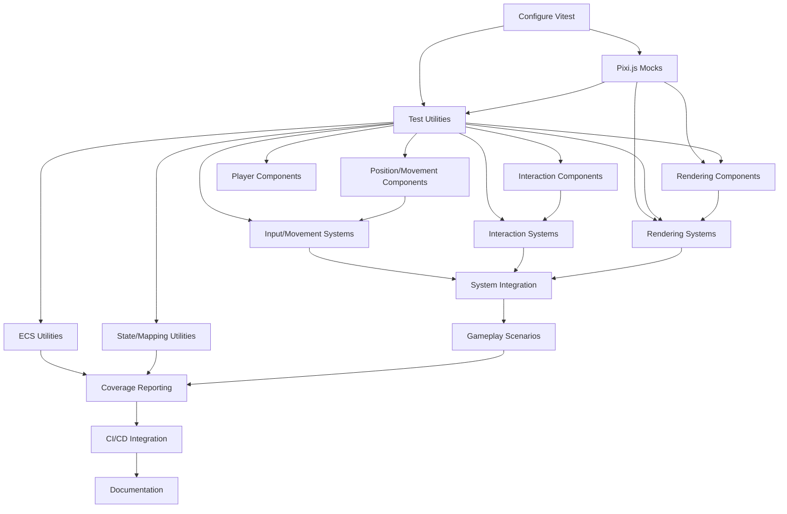

# Task List: Testing Suite Implementation

**Generated from:** `prd-testing-suite.md`  
**Target:** Junior Developer  
**Estimated Duration:** 38 hours  
**GitHub Issue:** [#36 - Create Comprehensive Testing Suite for ECS Game Logic](https://github.com/cryosis7/UntitleGame/issues/36)

## Task Categories

### Setup & Infrastructure
- [x] **T001: Configure Vitest for ECS Testing** *(2 hours)*
  - [x] Create vitest.config.ts with ECS-specific settings
  - [x] Configure test environment for jsdom and React components
  - [x] Set up global test configuration and setup files
  - [x] Verify existing @testing-library integration works correctly
  - [ ] **Dependencies**: None
  - [x] **Verification**: `npm test` runs without errors, shows proper test environment

- [x] **T002: Create Pixi.js Mocking Infrastructure** *(3 hours)*
  - [x] Create `src/__tests__/mocks/pixiMocks.ts` with core Pixi.js mocks
  - [x] Mock Application, Container, Sprite, Graphics, Ticker classes
  - [x] Implement mock methods that return predictable values for testing
  - [x] Create mock factory functions for common Pixi.js objects
  - [x] Test mocks work correctly with existing Pixi.js usage
  - [ ] **Dependencies**: T001 (Vitest config)
  - [x] **Verification**: Mocked Pixi.js objects can be imported and used in tests

- [x] **T003: Build ECS Test Utilities** *(4 hours)*
  - [x] Create `src/__tests__/testUtils.ts` with ECS helper functions
  - [x] Implement entity factory functions for testing (createTestEntity, createTestComponent)
  - [x] Build component assertion helpers (expectEntityHasComponent, expectComponentProps)
  - [x] Create system testing utilities (createTestUpdateArgs, mockGameMap)
  - [x] Add cleanup utilities for test isolation
  - [x] **Dependencies**: T001, T002 (test environment and mocks)
  - [x] **Verification**: Test utilities can create entities and components for testing

### Component Unit Tests
- [x] **T004: Core Position and Movement Components** *(3 hours)*
  - [x] Test PositionComponent creation, validation, and edge cases
  - [x] Test VelocityComponent with valid/invalid velocity values
  - [x] Test MovableComponent behavior and state management
  - [x] Verify component serialization and property validation
  - [x] Test boundary conditions (negative coordinates, zero velocity)
  - [x] **Dependencies**: T003 (test utilities)
  - [x] **Verification**: 100% test coverage for position/movement components

- [x] **T005: Interaction and Item Components** *(3 hours)*
  - [x] Test PickableComponent item properties and states
  - [x] Test CarriedItemComponent inventory management
  - [x] Test InteractingComponent interaction states
  - [x] Test HandlingComponent interaction handling logic
  - [x] Verify component state transitions and validation
  - [x] **Dependencies**: T003 (test utilities)
  - [x] **Verification**: 100% test coverage for interaction components

- [x] **T006: Rendering and UI Components** *(2 hours)*
  - [x] Test SpriteComponent with various sprite configurations
  - [x] Test RenderInSidebarComponent UI state management
  - [x] Test WalkableComponent collision properties
  - [x] Verify component integration with mocked Pixi.js objects
  - [x] **Dependencies**: T002, T003 (mocks and utilities)
  - [x] **Verification**: Components work with mocked rendering system

- [x] **T007: Player and Game State Components** *(2 hours)*
  - [x] Test PlayerComponent player-specific properties
  - [x] Verify component state management and updates
  - [x] Test edge cases and invalid state transitions
  - [x] Ensure components integrate properly with ECS system
  - [x] **Dependencies**: T003 (test utilities)
  - [x] **Verification**: Player components pass all unit tests

### System Unit Tests
- [x] **T008: Input and Movement Systems** *(3 hours)*
  - [x] Test KeyboardInputSystem key event processing
  - [x] Test MovementSystem entity position updates
  - [x] Verify collision detection and movement validation
  - [x] Test system behavior with empty entity arrays
  - [x] Test edge cases (blocked movement, invalid positions)
  - [x] **Dependencies**: T003, T004 (utilities and components)
  - [x] **Verification**: Movement systems handle all scenarios correctly

- [x] **T009: Interaction Systems** *(3 hours)*
  - [x] Test PickupSystem item collection mechanics
  - [x] Test entity state changes during pickup operations
  - [x] Test inventory management and item handling
  - [x] Verify system properly filters entities by components
  - [x] Test failure scenarios (full inventory, invalid items)
  - [x] **Dependencies**: T003, T005 (utilities and interaction components)
  - [x] **Verification**: Pickup system correctly manages item interactions

- [ ] **T010: Rendering and Management Systems** *(3 hours)*
  - [ ] Test RenderSystem with mocked Pixi.js components
  - [ ] Test CleanUpSystem entity cleanup operations
  - [ ] Test EntityPlacementSystem for map editor functionality
  - [ ] Test RenderSidebarSystem UI rendering logic
  - [ ] Verify systems handle entity lifecycle correctly
  - [ ] **Dependencies**: T002, T003, T006 (mocks, utilities, rendering components)
  - [ ] **Verification**: Rendering systems work with mocked graphics

### Utility Function Tests
- [ ] **T011: ECS and Entity Utilities** *(2 hours)*
  - [ ] Test ecsUtils functions (getEmptyPosition, entity operations)
  - [ ] Test EntityUtils (addEntities, entity management functions)
  - [ ] Test EntityFactory (createEntitiesFromTemplates)
  - [ ] Verify utility functions handle edge cases properly
  - [ ] Test error handling for invalid inputs
  - [ ] **Dependencies**: T003 (test utilities)
  - [ ] **Verification**: All utility functions pass unit tests

- [ ] **T012: Game State and Mapping Utilities** *(2 hours)*
  - [ ] Test MappingUtils coordinate conversion functions
  - [ ] Test Atoms (Jotai state management) with mock stores
  - [ ] Test utility integration with game state management
  - [ ] Verify mapping functions handle boundary conditions
  - [ ] **Dependencies**: T003 (test utilities)
  - [ ] **Verification**: State management and mapping utilities work correctly

### Integration Testing
- [ ] **T013: ECS System Integration** *(4 hours)*
  - [ ] Test multiple systems processing the same entities
  - [ ] Test system execution order and dependencies
  - [ ] Test entity lifecycle through multiple system updates
  - [ ] Verify component interactions across systems
  - [ ] Test system state isolation and side effects
  - [ ] **Dependencies**: T008, T009, T010 (all systems tested)
  - [ ] **Verification**: Systems work together without conflicts

- [ ] **T014: Core Gameplay Scenarios** *(4 hours)*
  - [ ] Test complete player movement workflow (input → movement → rendering)
  - [ ] Test item pickup workflow (detection → collection → inventory update)
  - [ ] Test collision detection preventing invalid movements
  - [ ] Test map editor entity placement and manipulation
  - [ ] Verify game state persistence across operations
  - [ ] **Dependencies**: T013 (system integration)
  - [ ] **Verification**: All critical gameplay flows work end-to-end

### Coverage & CI/CD
- [ ] **T015: Coverage Reporting and Analysis** *(2 hours)*
  - [ ] Configure coverage thresholds (80% line coverage for game logic)
  - [ ] Set up coverage reporting with detailed breakdowns
  - [ ] Create coverage exclusion rules for non-game code
  - [ ] Implement coverage validation in test pipeline
  - [ ] **Dependencies**: T001-T014 (all tests implemented)
  - [ ] **Verification**: Coverage reports show ≥80% for game logic modules

- [ ] **T016: GitHub Actions CI/CD Integration** *(3 hours)*
  - [ ] Create `.github/workflows/test.yml` for automated testing
  - [ ] Configure test execution on PR and main branch pushes
  - [ ] Set up coverage reporting in PR comments
  - [ ] Configure test failure notifications and debugging info
  - [ ] Test CI/CD pipeline with sample PR
  - [ ] **Dependencies**: T015 (coverage setup)
  - [ ] **Verification**: Tests run automatically on GitHub, coverage reports in PRs

### Documentation
- [ ] **T017: Testing Documentation and Guidelines** *(2 hours)*
  - [ ] Create testing best practices guide for ECS architecture
  - [ ] Document test utilities and helper functions usage
  - [ ] Create examples for writing new component and system tests
  - [ ] Document CI/CD process and coverage requirements
  - [ ] **Dependencies**: T001-T016 (all implementation complete)
  - [ ] **Verification**: Complete testing documentation available for developers

## Task Dependencies

## Task Summary by Phase

### Phase 1: Foundation (8 hours)
- T001: Configure Vitest (2h)
- T002: Pixi.js Mocks (3h) 
- T003: Test Utilities (4h)
*Can work in sequence*

### Phase 2: Unit Tests (20 hours)
- T004-T007: Component Tests (10h) *Can work in parallel after T003*
- T008-T010: System Tests (9h) *Can work in parallel after component tests*
- T011-T012: Utility Tests (4h) *Can work in parallel after T003*

### Phase 3: Integration (8 hours)
- T013: System Integration (4h)
- T014: Gameplay Scenarios (4h)
*Must be sequential*

### Phase 4: Finalization (4 hours)
- T015: Coverage Reporting (2h)
- T016: CI/CD Integration (3h) 
- T017: Documentation (2h)
*T015-T016 sequential, T017 can be parallel*

**Total Estimated Time: 38 hours**

## Relevant Files

### Existing Files (To be tested)
- `src/game/components/individualComponents/*.ts` - All ECS components
- `src/game/systems/*.ts` - All ECS systems
- `src/game/utils/ecsUtils.ts` - Core ECS utilities
- `src/game/utils/EntityUtils.ts` - Entity management
- `src/game/utils/EntityFactory.ts` - Entity creation
- `src/game/map/MappingUtils.ts` - Coordinate mapping
- `src/game/utils/Atoms.ts` - State management
- `package.json` - Existing Vitest configuration
- `src/setupTests.ts` - Current test setup

### New Files (To be created)
- `vitest.config.ts` - Enhanced Vitest configuration
- `src/__tests__/setup.ts` - Global test setup
- `src/__tests__/testUtils.ts` - ECS testing utilities
- `src/__tests__/mocks/pixiMocks.ts` - Pixi.js mocks
- `src/game/components/individualComponents/__tests__/*.test.ts` - Component tests
- `src/game/systems/__tests__/*.test.ts` - System tests
- `src/game/utils/__tests__/*.test.ts` - Utility tests
- `src/game/__tests__/gameplayScenarios.test.ts` - Integration tests
- `src/game/__tests__/ecsIntegration.test.ts` - System integration tests
- `.github/workflows/test.yml` - CI/CD pipeline
- `docs/testing-guide.md` - Testing documentation

### Integration Points
- **Vitest Configuration**: Enhanced setup for ECS and Pixi.js testing
- **GitHub Actions**: Automated testing and coverage reporting
- **Package.json**: Updated scripts and dependencies if needed
- **ECS Architecture**: Test utilities must understand entity-component-system patterns
- **Jotai State**: Tests must work with Jotai atoms and state management
